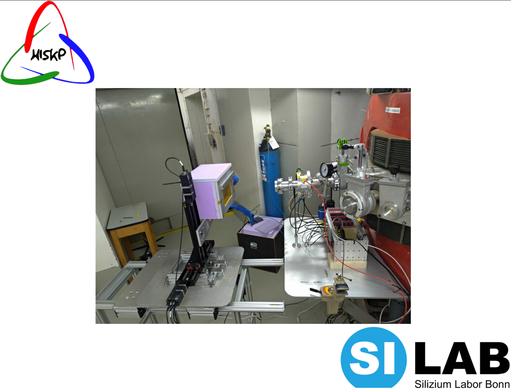

==================================
Irrad_Control
==================================

Introduction
============

``irrad_control`` is a GUI-based control, data acquisition (DAQ) and visualization software for the proton irradiation site at the `Bonn isochronous cyclotron <https://www.zyklotron.hiskp.uni-bonn.de/zyklo_e/index.html>`_, located at the Helmholtz Institut für Strahlen- und Kernphysik (`HISKP <https://www.hiskp.uni-bonn.de/>`_), of Bonn University. It consists of software which runs on an on-site *Raspberry Pi* server controlling the setup and on the DAQ PC interpreting and visualizing data as well as controlling the server.

Installation
============

You have to have Python 2/3 with the following packages installed:

- numpy
- pyyaml
- pyzmq
- pytables
- pyqt
- `pyqtgraph <http://pyqtgraph.org/>`_
- paramiko

It's recommended to use a Python environment like `Miniconda <https://conda.io/miniconda.html>`_. After installation you can use Minicondas package manager ``conda`` to install the required packages

.. code-block:: bash

   conda install numpy pyyaml pytables pyqt pyzmq pyqtgraph paramiko

To finally install ``irrad_control`` on the DAQ PC run the setup script

.. code-block:: bash

   python setup.py develop

Setup Control & DAQ
===================

The irradiation setup is controlled by a RaspberryPi 3 server which handles a XY-Stage as well as an extension
`ADDA board <https://www.waveshare.com/wiki/High-Precision_AD/DA_Board>`_ which is used for beam current measurement.
A ``ssh key`` of the host PC must be copied to the server Raspberry Pi. Create and copy a key via

.. code-block::

   ssh-keygen -b 2048 -t rsa
   ssh-copy-id pi@ip

where ``ip`` is the ip of the Raspberry Pi within the network. The server is then automatically set up on first use with ``irrad_control``.

Data Visualization
==================
